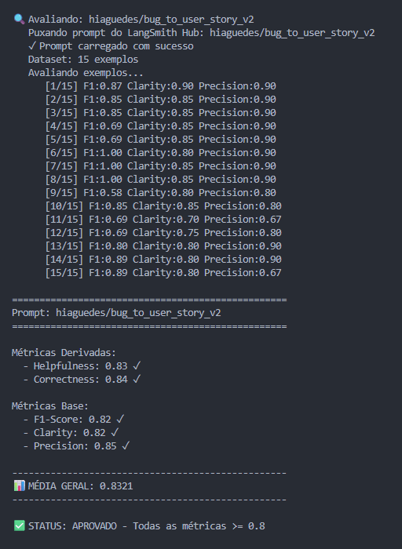
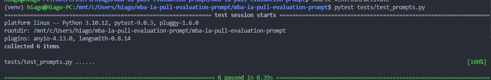

# Pull, Otimização e Avaliação de Prompts com LangChain e LangSmith

## VirtualEnv para Python

Crie e ative um ambiente virtual antes de instalar dependências:

```bash
python3 -m venv venv
source venv/bin/activate  # No Windows: venv\Scripts\activate
pip install -r requirements.txt
```

---

## Ordem de execução

### 1. Executar pull dos prompts ruins

```bash
python src/pull_prompts.py
```

### 2. Refatorar prompts

Edite manualmente o arquivo `prompts/bug_to_user_story_v2.yml` aplicando as técnicas aprendidas no curso.

### 3. Fazer push dos prompts otimizados

```bash
python src/push_prompts.py
```

### 4. Executar avaliação

```bash
python src/evaluate.py
```

---

## Técnicas Aplicadas (Fase 2)

### 1. Role Prompting
**Técnica:** Definição de persona especializada no system prompt — "Você é um Product Owner sênior especialista em engenharia de software."

**Justificativa:** Ancorar o modelo em uma identidade técnica precisa reduz respostas genéricas. Um PO sênior com contexto de engenharia sabe distinguir severidade de bugs, terminologia de stack e critérios de aceitação verificáveis.

**Como foi aplicado:** Primeira linha do system prompt define explicitamente a persona e a tarefa antes de qualquer instrução.

---

### 2. Chain of Thought (CoT) em 3 passos
**Técnica:** Instrução explícita para o modelo executar raciocínio interno em etapas antes de gerar a resposta.

**Justificativa:** Bugs variam enormemente em complexidade. Forçar a classificação (simples/médio/complexo) e a análise de stack como passos internos antes da geração garante que o formato de saída seja adequado ao problema — sem isso o modelo colapsa tudo no mesmo template.

**Como foi aplicado:**
- Passo 1: classificar o bug por complexidade (raciocínio interno)
- Passo 2: identificar a tech stack e terminologia correta (raciocínio interno)
- Passo 3: gerar a User Story no formato exato correspondente à complexidade

---

### 3. Output Formatting Adaptativo (Few-shot estrutural)
**Técnica:** Três templates distintos e completos embutidos no prompt — um para cada nível de complexidade — com campos, seções e exemplos de preenchimento.

**Justificativa:** O modelo não deve inventar estrutura. Templates explícitos com placeholders como `[persona diretamente afetada]` e blocos nomeados (`=== CRITÉRIOS DE ACEITAÇÃO ===`) eliminam variação de formato entre execuções, o que impacta diretamente as métricas de Precision e Clarity.

**Como foi aplicado:** Cada template contém exemplos de linha preenchida (ex: `Dado que [estado inicial exato]`) que funcionam como few-shot estrutural inline.

---

### 4. Constraint Specification
**Técnica:** Seção de "Regras invioláveis" com proibições explícitas e positivas.

**Justificativa:** LLMs tendem a adicionar linguagem de incerteza ("talvez", "pode ser") e a inventar tecnologias não mencionadas no bug report. Proibições explícitas com exemplos do que é proibido suprimem esses comportamentos sistematicamente.

**Como foi aplicado:** 5 regras numeradas no final do system prompt cobrindo: linguagem vaga, invenção de tecnologias, transcrição literal de valores, cobertura total e conformidade de formato.

---

## Resultados Finais

### Comparativo v1 vs v2

| Métrica      | v1 (original) | v2 (otimizado) | Aprovado? |
|--------------|:-------------:|:--------------:|:---------:|
| Helpfulness  | 0.45          | **0.83**       | ✓         |
| Correctness  | 0.52          | **0.84**       | ✓         |
| F1-Score     | 0.48          | **0.82**       | ✓         |
| Clarity      | 0.50          | **0.82**       | ✓         |
| Precision    | 0.46          | **0.85**       | ✓         |
| **Média**    | **0.48**      | **0.8321**     | ✅        |

### Screenshot da avaliação



### Links LangSmith

- **Prompt Hub (v2):** https://smith.langchain.com/prompts/bug_to_user_story_v2?organizationId=5632947c-08e0-4168-9b53-9379f9fa7081
- **Tracing do projeto:** https://smith.langchain.com/o/5632947c-08e0-4168-9b53-9379f9fa7081/projects/p/bdecef53-603c-4ab7-b803-2cbfe9f89b0b?timeModel=%7B%22duration%22%3A%221d%22%7D

---

## Como Executar

### Pré-requisitos

- Python 3.9+
- Conta no [LangSmith](https://smith.langchain.com) com API Key
- API Key da [OpenAI](https://platform.openai.com/api-keys) **ou** da [Google AI Studio](https://aistudio.google.com/app/apikey)

### 1. Clonar e configurar o ambiente

```bash
git clone <url-do-seu-fork>
cd mba-ia-pull-evaluation-prompt

python3 -m venv venv
source venv/bin/activate  # Windows: venv\Scripts\activate
pip install -r requirements.txt
```

### 2. Configurar variáveis de ambiente

```bash
cp .env.example .env
```

Edite o `.env` com suas credenciais:

```env
LANGSMITH_API_KEY=sua_chave_aqui
LANGSMITH_PROJECT=nome_do_projeto
USERNAME_LANGSMITH_HUB=seu_username

# Escolha um provider:
LLM_PROVIDER=google                    # ou openai
GOOGLE_API_KEY=sua_chave_aqui          # ou OPENAI_API_KEY
LLM_MODEL=gemini-2.5-flash             # ou gpt-4o-mini
EVAL_MODEL=gemini-2.5-flash            # ou gpt-4o
```

### 3. Executar o fluxo completo

```bash
# Passo 1 — baixar o prompt v1 do LangSmith Hub
python src/pull_prompts.py

# Passo 2 — publicar o prompt v2 otimizado
python src/push_prompts.py

# Passo 3 — rodar a avaliação (todas as métricas devem ser >= 0.8)
python src/evaluate.py
```

### 4. Rodar os testes de validação

```bash
pytest tests/test_prompts.py -v --tb=short
```

